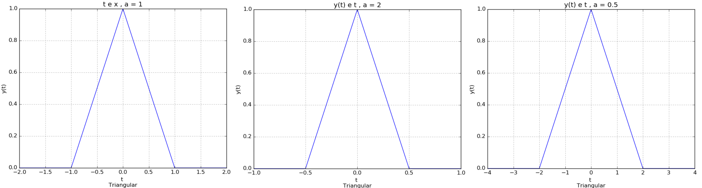

# Sinais e Sistemas
> Short blurb about what your product does.

[![NPM Version][npm-image]][npm-url]
[![Build Status][travis-image]][travis-url]
[![Downloads Stats][npm-downloads]][npm-url]

One to two paragraph statement about your product and what it does.




## Code 01

Bibliotecas:
```sh
import matplotlib.pyplot
import math
```

```sh
import matplotlib.pyplot
import math
#function generetor the vector
def vector_generetor(i0,n,i1):
    vetor_t = list(range(i0, n, i1))
    vector_time = []
    interval = 0.1 # interval between each element of the vector
    for element in vetor_t:
        vector_time.append(interval * element)
    return vector_time
a = 0.5
b = 450
# calcular c
#c = 1# c=0 equilibrio, - 
vector_time = vector_generetor(1,100,1)
def edo_ordem_01(a,b,vector_time):
    v_p = b/a
    vector_result = []
    vector_result2 = []
    #vector_time = vector_generetor(1,100,1)
    for element in vector_time:
        vector_result.append(900 + (math.exp(a*element)))

    #print(vector_result)

    matplotlib.pyplot.plot(vector_time, vector_result)
    matplotlib.pyplot.show() # plot graph

edo_ordem_01(a,b,vector_time)

```


```sh
edit autoexec.bat
```


## Questão

Describe how to install all development dependencies and how to run an automated test-suite of some kind. Potentially do this for multiple platforms.

```sh
make install
npm test
```

## Variáveis independentes
 `y(t) = x(at)`
* Mudança de escala de tempo
    * O sinal comprime:  `Se a > 1`
    * O sinal expande: `Se 0 < a < 1`


## Code 02

Bibliotecas:
```sh
import matplotlib.pyplot as plt
import numpy as np
import math
```

```sh

# Vetores para função senoidal
#'''
t = np.arange(0.0, 4.0, 0.01)
x = 1 + np.sin(2*np.pi*t) # function sin
#'''

# Vetores para função Triangular, vetores explícitos
'''
t = [-2,-1,0,1,2]
x = [0,0,1,0,0]
'''
def time_scale_change(x, t, a):
    y = [] # vector out
    if a > 0:
        for i in t:
            y.append(i/a)

    #plt.plot(t,x,'r-', y,x,'b-')
    plt.plot(t,x,'b-', y,x,'r-')
    #plt.plot(y,x,'b-')
    
    #plt.xlabel('t \n Triangular ')
    plt.xlabel('t \n Senoidal ')
    plt.ylabel('y(t)')
    plt.title(' y(t) e t , a = 1(blue), a = 0.3(red)  ') #| BLUE: y(t) = x(at), a = 0.5')
    plt.grid(True)
    #plt.savefig("sigmal_triangular.png")
    plt.savefig("sigmal_sin.png")
    plt.show()

time_scale_change(x, t,0.3)
```

## Em construção ....


